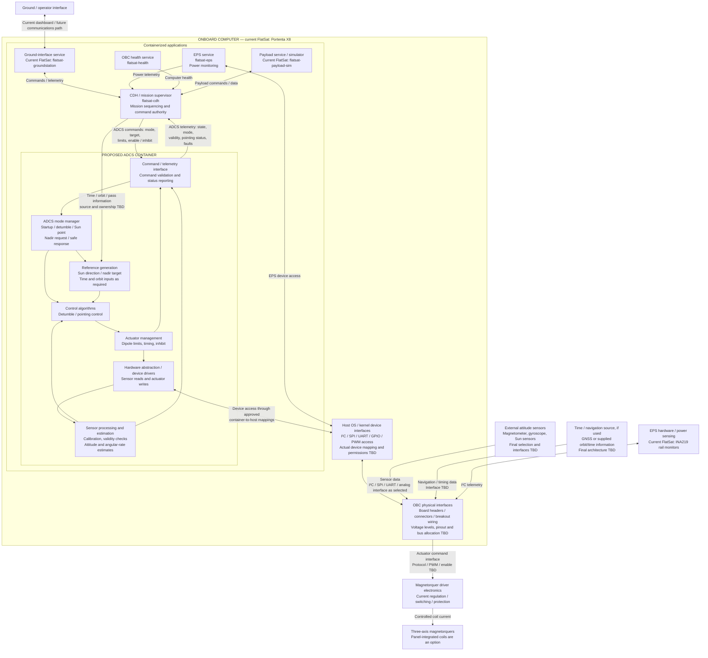

```mermaid
flowchart TB
    GROUND["Ground / operator interface"]

    subgraph OBC["ONBOARD COMPUTER — current FlatSat: Portenta X8"]
        direction TB

        subgraph APPS["Containerized applications"]
            direction LR
            GS["Ground-interface service<br/>Current FlatSat: flatsat-groundstation"]
            CDH["CDH / mission supervisor<br/>flatsat-cdh<br/>Mission sequencing and command authority"]
            EPS["EPS service<br/>flatsat-eps<br/>Power monitoring"]
            HEALTH["OBC health service<br/>flatsat-health"]
            PAYLOAD["Payload service / simulator<br/>Current FlatSat: flatsat-payload-sim"]

            subgraph ADCS["PROPOSED ADCS CONTAINER"]
                direction TB
                CMD["Command / telemetry interface<br/>Command validation and status reporting"]
                MODE["ADCS mode manager<br/>Startup / detumble / Sun point<br/>Nadir request / safe response"]
                EST["Sensor processing and estimation<br/>Calibration, validity checks<br/>Attitude and angular-rate estimates"]
                REF["Reference generation<br/>Sun direction / nadir target<br/>Time and orbit inputs as required"]
                CTRL["Control algorithms<br/>Detumble / pointing control"]
                ACT["Actuator management<br/>Dipole limits, timing, inhibit"]
                HAL["Hardware abstraction / device drivers<br/>Sensor reads and actuator writes"]

                CMD --> MODE
                MODE --> REF
                MODE --> CTRL
                REF --> CTRL
                EST --> CTRL
                CTRL --> ACT
                ACT --> HAL
                HAL --> EST
                EST --> CMD
                ACT --> CMD
            end

            GS <-->|"Commands / telemetry"| CDH
            EPS -->|"Power telemetry"| CDH
            HEALTH -->|"Computer health"| CDH
            PAYLOAD <-->|"Payload commands / data"| CDH
            CDH -->|"ADCS commands: mode, target,<br/>limits, enable / inhibit"| CMD
            CMD -->|"ADCS telemetry: state, mode,<br/>validity, pointing status, faults"| CDH
            CDH -->|"Time / orbit / pass information<br/>source and ownership TBD"| REF
        end

        OS["Host OS / kernel device interfaces<br/>I²C / SPI / UART / GPIO / PWM access<br/>Actual device mapping and permissions TBD"]

        HAL <-->|"Device access through approved<br/>container-to-host mappings"| OS
        EPS <-->|"EPS device access"| OS

        PORTS["OBC physical interfaces<br/>Board headers / connectors / breakout wiring<br/>Voltage levels, pinout and bus allocation TBD"]
        OS <--> PORTS
    end

    GROUND <-->|"Current dashboard / future communications path"| GS

    SENS["External attitude sensors<br/>Magnetometer, gyroscope, Sun sensors<br/>Final selection and interfaces TBD"]
    NAV["Time / navigation source, if used<br/>GNSS or supplied orbit/time information<br/>Final architecture TBD"]
    DRIVER["Magnetorquer driver electronics<br/>Current regulation / switching / protection"]
    COILS["Three-axis magnetorquers<br/>Panel-integrated coils are an option"]
    EPSHW["EPS hardware / power sensing<br/>Current FlatSat: INA219 rail monitors"]

    SENS -->|"Sensor data<br/>I²C / SPI / UART / analog interface as selected"| PORTS
    NAV -->|"Navigation / timing data<br/>Interface TBD"| PORTS
    PORTS -->|"Actuator command interface<br/>Protocol / PWM / enable TBD"| DRIVER
    DRIVER -->|"Controlled coil current"| COILS
    EPSHW <-->|"I²C telemetry"| PORTS
```
