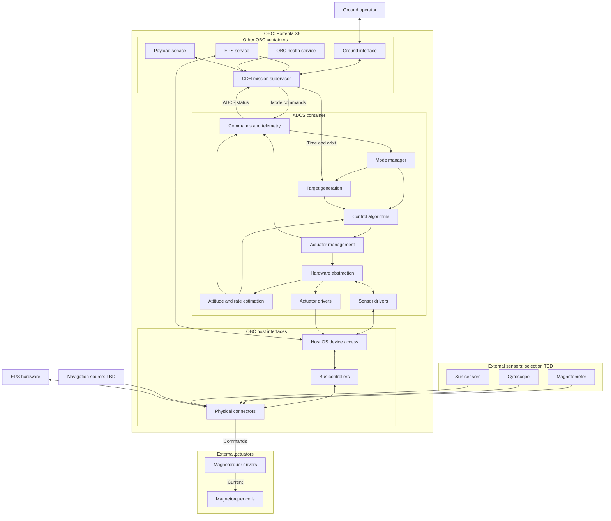

```mermaid
%%{init: {"flowchart": {"htmlLabels": false, "nodeSpacing": 35, "rankSpacing": 45}}}%%
flowchart TB

    GROUND["Ground operator"]

    subgraph OBC["OBC: Portenta X8"]
        direction TB

        subgraph SERVICES["Other OBC containers"]
            GS["Ground interface"]
            CDH["CDH mission supervisor"]
            EPS["EPS service"]
            HEALTH["OBC health service"]
            PAYLOAD["Payload service"]

            GS <--> CDH
            EPS --> CDH
            HEALTH --> CDH
            PAYLOAD <--> CDH
        end

        subgraph ADCS["ADCS container"]
            CMD["Commands and telemetry"]
            MODE["Mode manager"]
            REF["Target generation"]
            EST["Attitude and rate estimation"]
            CTRL["Control algorithms"]
            ACT["Actuator management"]
            HAL["Hardware abstraction"]
            SD["Sensor drivers"]
            AD["Actuator drivers"]

            CMD --> MODE
            MODE --> REF
            MODE --> CTRL
            REF --> CTRL
            EST --> CTRL
            CTRL --> ACT
            ACT --> HAL
            HAL --> EST
            HAL <--> SD
            HAL --> AD
            EST --> CMD
            ACT --> CMD
        end

        subgraph HOST["OBC host interfaces"]
            OS["Host OS device access"]
            BUS["Bus controllers"]
            PORTS["Physical connectors"]

            OS <--> BUS
            BUS <--> PORTS
        end

        CDH -->|Mode commands| CMD
        CMD -->|ADCS status| CDH
        CDH -->|Time and orbit| REF

        SD <--> OS
        AD --> OS
        EPS <--> OS
    end

    subgraph SENSORS["External sensors: selection TBD"]
        MAG["Magnetometer"]
        GYRO["Gyroscope"]
        SUN["Sun sensors"]
    end

    subgraph ACTUATORS["External actuators"]
        DRIVER["Magnetorquer drivers"]
        COILS["Magnetorquer coils"]

        DRIVER -->|Current| COILS
    end

    NAV["Navigation source: TBD"]
    EPSHW["EPS hardware"]

    GROUND <--> GS

    MAG --> PORTS
    GYRO --> PORTS
    SUN --> PORTS
    NAV --> PORTS

    PORTS -->|Commands| DRIVER
    EPSHW <--> PORTS
```
