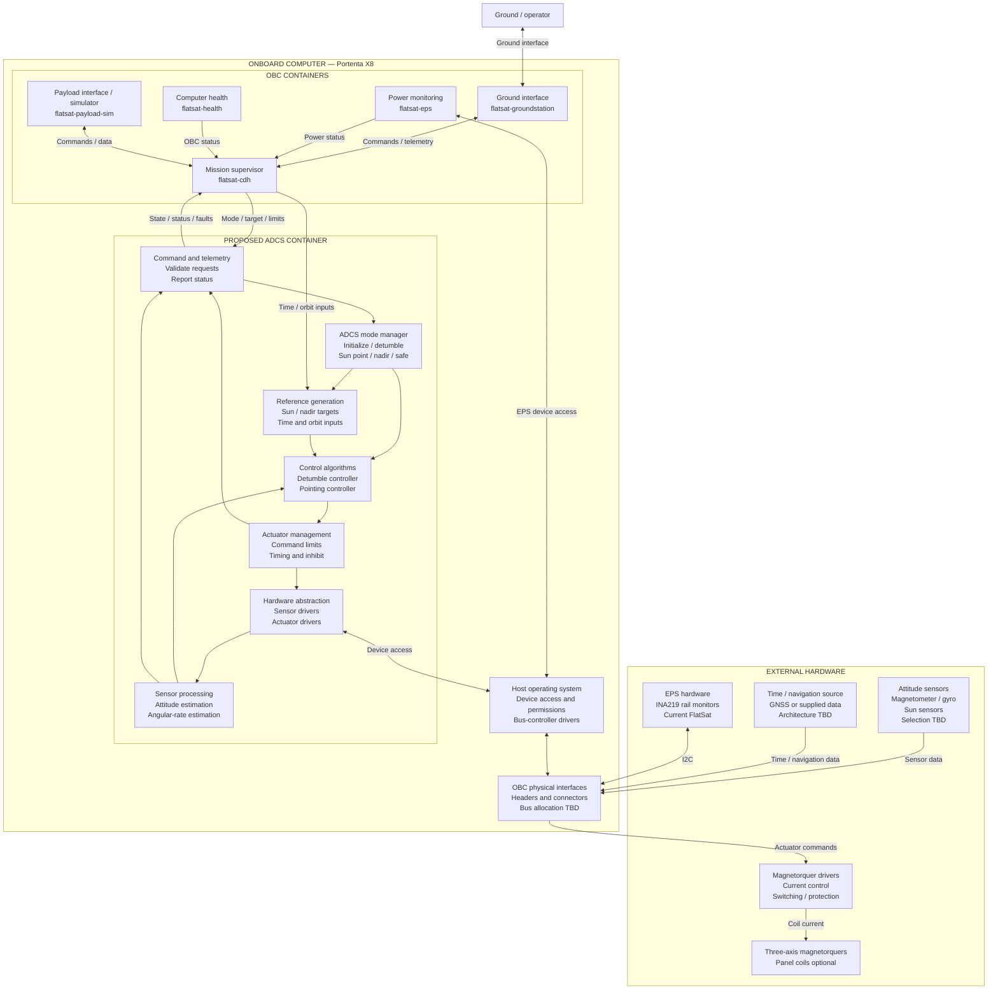

```mermaid
flowchart TB
    GROUND["Ground / operator"]

    subgraph OBC["ONBOARD COMPUTER — Portenta X8"]
        direction TB

        subgraph SERVICES["OBC CONTAINERS"]
            direction TB

            GS["Ground interface<br/>flatsat-groundstation"]
            CDH["Mission supervisor<br/>flatsat-cdh"]
            EPS["Power monitoring<br/>flatsat-eps"]
            HEALTH["Computer health<br/>flatsat-health"]
            PAYLOAD["Payload interface / simulator<br/>flatsat-payload-sim"]

            GS <-->|Commands / telemetry| CDH
            EPS -->|Power status| CDH
            HEALTH -->|OBC status| CDH
            PAYLOAD <-->|Commands / data| CDH
        end

        subgraph ADCS["PROPOSED ADCS CONTAINER"]
            direction TB

            CMD["Command and telemetry<br/>Validate requests<br/>Report status"]
            MODE["ADCS mode manager<br/>Initialize / detumble<br/>Sun point / nadir / safe"]
            REF["Reference generation<br/>Sun / nadir targets<br/>Time and orbit inputs"]
            EST["Sensor processing<br/>Attitude estimation<br/>Angular-rate estimation"]
            CTRL["Control algorithms<br/>Detumble controller<br/>Pointing controller"]
            ACT["Actuator management<br/>Command limits<br/>Timing and inhibit"]
            HAL["Hardware abstraction<br/>Sensor drivers<br/>Actuator drivers"]

            CMD --> MODE
            MODE --> REF
            MODE --> CTRL
            REF --> CTRL
            EST --> CTRL
            CTRL --> ACT
            ACT --> HAL
            HAL --> EST
            EST --> CMD
            ACT --> CMD
        end

        OS["Host operating system<br/>Device access and permissions<br/>Bus-controller drivers"]

        PORTS["OBC physical interfaces<br/>Headers and connectors<br/>Bus allocation TBD"]

        CDH -->|Mode / target / limits| CMD
        CMD -->|State / status / faults| CDH
        CDH -->|Time / orbit inputs| REF

        HAL <-->|Device access| OS
        EPS <-->|EPS device access| OS
        OS <--> PORTS
    end

    subgraph HARDWARE["EXTERNAL HARDWARE"]
        direction TB

        SENS["Attitude sensors<br/>Magnetometer / gyro<br/>Sun sensors<br/>Selection TBD"]

        NAV["Time / navigation source<br/>GNSS or supplied data<br/>Architecture TBD"]

        DRIVER["Magnetorquer drivers<br/>Current control<br/>Switching / protection"]

        COILS["Three-axis magnetorquers<br/>Panel coils optional"]

        EPSHW["EPS hardware<br/>INA219 rail monitors<br/>Current FlatSat"]

        DRIVER -->|Coil current| COILS
    end

    GROUND <-->|Ground interface| GS
    SENS -->|Sensor data| PORTS
    NAV -->|Time / navigation data| PORTS
    PORTS -->|Actuator commands| DRIVER
    EPSHW <-->|I2C| PORTS
```
